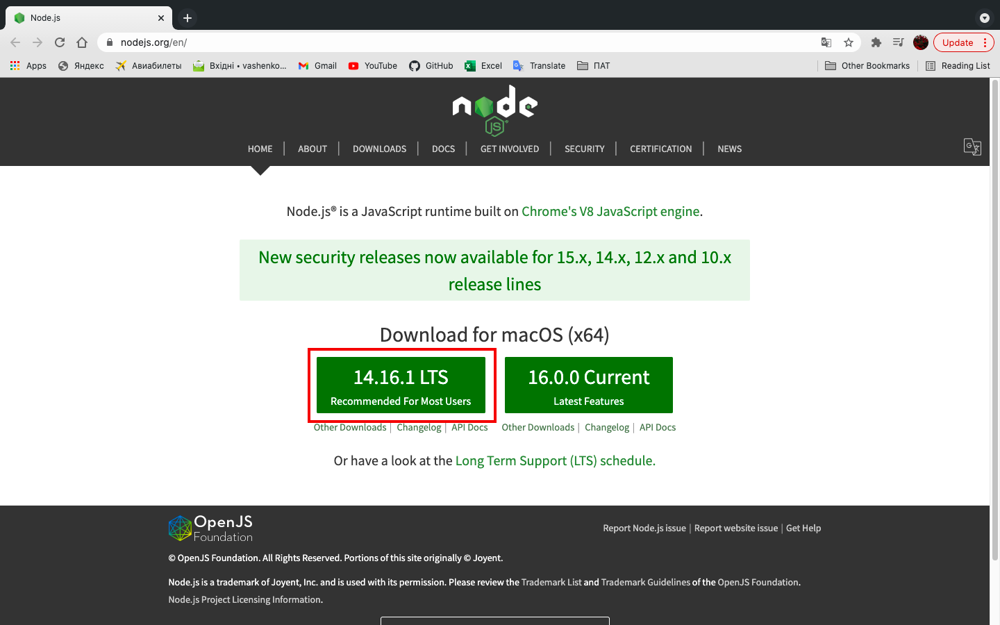

# Cоздание приложения «TODO List App»


# Framework App 
> _Ежидневное планирование вашего дня важен, потому что это основа, которая поможет вам достичь поставленных целей и достичь конечных целей. Наличие плана поможет вам определить весь объем проекта, но также поможет вам сосредоточиться, поставить цели и задачи, уложиться в сроки, измерить успех и проанализировать весь проект._

### _Краткая информация_
-------------------------
```sh
npx create-react framework
cd projectreact
npm start 
```
Если вы ранее устанавливали ```create-react-app``` глобально через ```npm install -g create-react-app```, мы рекомендуем вам удалить пакет с помощью npm ```uninstall -g create-react-app``` или,```yarn global remove create-react-app``` чтобы убедиться, что npx всегда использует последнюю версию.

Затем откройте http://localhost:3000/, чтобы увидеть ваше приложение.
Когда вы будете готовы, создайте миниатюрный пакет с `npm run build`.

### _Создание приложения_
Вам понадобится установить на ваш компьютер `Node`. Перейдите по этой ссылки [Node.js](https://nodejs.org/en/). 


После загрузки мы можем проверить, установлен ли узел на нашем локальном компьютере, открыв терминал устройства или командную строку.
```
iravasenko$ node -v
Версия 14.16.0
```

Чтобы создать новое приложение, вы можете выбрать один из следующих способов:

##### npx
```
npx create-react-app 'app name'
```
##### npm
```
npm init react-app 'app name'
```
##### yanr
```
yarn create react-app 'app name'
```
Он создаст каталог 'app name' внутри текущей папки.
Внутри этого каталога он сгенерирует исходную структуру проекта и установит транзитивные зависимости:
```
'app name'
├── README.md
├── node_modules
├── package.json
├── .gitignore
├── public
│   ├── favicon.ico
│   ├── index.html
│   └── manifest.json
└── src
    ├── App.css
    ├── App.js
    ├── App.test.js
    ├── index.css
    ├── index.js
    ├── logo.svg
    └── serviceWorker.js
    └── setupTests.js
```
После завершения установки вы должны открыть файл, где находится ваш проект:
```sh
cd 'app name'
```
Внутри проекта, вы можете запустить ваше приложение, с помощью команд: 
##### `npm stare` или `yarn start`

Запустить средство наблюдения за тестами в интерактивном режиме, с помощью команд: 
##### `npm test` или `yarn test`

При создании приложение для производства в `build` папку.
##### `npm run build` или `yarn build`
* связывает React в производственном режиме;
* оптимизирует сборку для достижения максимальной производительности.

> Для подробного изучения `React.js`, переходите по этой ссылки [React](https://www.taniarascia.com/getting-started-with-react/), где вы создадите приложение в React с нуля, попутно изучая состояние, свойства и компоненты. 
